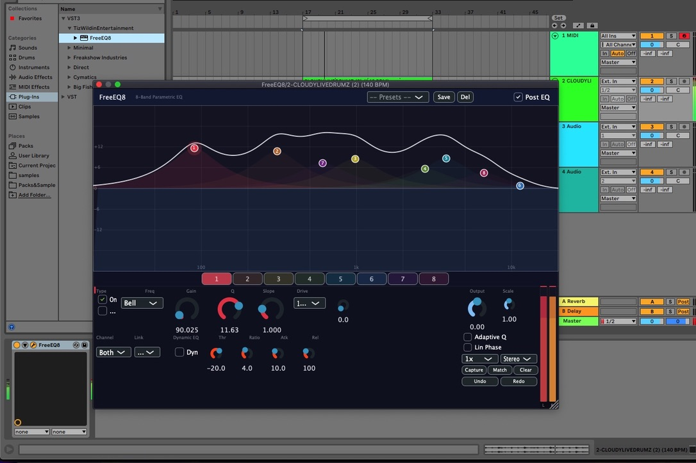

# FreeEQ8 - Professional 8-Band Parametric EQ Plugin

> **📥 [Download the latest release (macOS DMG & Windows ZIP)](https://github.com/GareBear99/FreeEQ8/releases/latest)**

[](LICENSE)
[]()
[](https://juce.com/)
[](https://github.com/GareBear99/FreeEQ8/releases/latest)

[](https://github.com/sponsors/GareBear99)
[](https://buymeacoffee.com/garebear99)
[](https://ko-fi.com/luciferai)

FreeEQ8 is a professional-grade, free, cross-platform 8-band parametric EQ plugin inspired by Ableton's EQ Eight. Built with JUCE for VST3 and AU formats.



## ✨ Features

### Core EQ
- **8 Independent Bands** — full parametric control (frequency, Q, gain)
- **6 Filter Types** per band: Bell, Low Shelf, High Shelf, High Pass, Low Pass, Bandpass
- **Multiple Slopes** — 12 / 24 / 48 dB/oct via cascaded biquad stages
- **Per-Band Enable/Disable & Solo** for A/B comparison and audition
- **Parameter Smoothing** (20ms linear interpolation, coefficients refreshed every 16 samples)

### Advanced Processing
- **Linear Phase Mode** — symmetric FIR from combined biquad magnitude, overlap-add FFT convolution (2048-sample latency when active)
- **Dynamic EQ** — per-band envelope follower with sidechain bandpass, threshold, ratio, attack & release
- **Per-Band Saturation / Drive** — gain-compensated tanh waveshaper (0–100%)
- **Mid/Side Processing** — M/S encode/decode with per-band channel routing (Both / L-Mid / R-Side)
- **Oversampling** — 1x / 2x / 4x / 8x using JUCE polyphase IIR half-band filters
- **Band Linking** — link groups A/B propagate frequency (ratio), gain & Q (delta) changes
- **Match EQ** — capture a reference spectrum, analyze current signal, compute & apply per-bin correction via FFT
- **Adaptive Q** — automatically widens Q with increasing gain

### Visualization & UI
- **Real-Time Spectrum Analyzer** — 4096-point FFT, Hann window, pre/post EQ toggle
- **Interactive Response Curve** — composite + per-band colored curves with dB/frequency grid
- **Draggable Band Nodes** — click-drag for freq/gain, shift+drag for Q, right-click context menu
- **Stereo Level Meter** — peak hold + RMS display
- **Selected-Band Paradigm** — 8 colored band buttons, single set of controls rebound per selection
- **Dark Theme** — resizable UI (750×550 to 1400×900)

### Global Controls
- **Output Gain** (-24 dB to +24 dB)
- **Scale** (0.1x to 2x) — scales all band gains simultaneously
- **Preset System** — save / load / delete, 8 factory presets
- **Undo / Redo** — integrated with JUCE UndoManager via APVTS
- **State Save/Restore** — all settings persist in your DAW project

### DSP Specifications
- Stereo processing (or Mid/Side)
- Sample rates: 44.1 kHz to 192 kHz+
- Transposed Direct Form II biquad with double-precision (64-bit) internal arithmetic
- RBJ Audio EQ Cookbook coefficients
- Zero latency in minimum-phase mode; linear phase adds 2048 samples
- Low CPU usage (disable unused bands, lower oversampling to reduce load)

## 🚀 Quick Start

### macOS
```bash
git clone --recursive https://github.com/GareBear99/FreeEQ8.git
cd FreeEQ8
./build_macos.sh
```

### Windows
```powershell
git clone --recursive https://github.com/GareBear99/FreeEQ8.git
cd FreeEQ8
.\build_windows.ps1
```

Plugins will be automatically installed to your system plugin directories.

## 📋 Build Instructions

### Prerequisites

#### macOS
- Xcode Command Line Tools: `xcode-select --install`
- CMake 3.15+: `brew install cmake`

#### Windows
- Visual Studio 2019+ with C++ build tools
- CMake 3.15+

### Detailed Build Steps

#### 1. Clone with JUCE Submodule

```bash
git clone --recursive https://github.com/GareBear99/FreeEQ8.git
cd FreeEQ8
```

If you already cloned without `--recursive`:
```bash
git submodule update --init --recursive
cd JUCE && git checkout 7.0.12 && cd ..
```

#### 2. Build

**macOS:**
```bash
chmod +x build_macos.sh
./build_macos.sh
```

**Windows:**
```powershell
.\build_windows.ps1
```

#### 3. Plugin Installation

**macOS (automatic):**
- VST3: `~/Library/Audio/Plug-Ins/VST3/FreeEQ8.vst3`
- AU: `~/Library/Audio/Plug-Ins/Components/FreeEQ8.component`

**Windows (manual):**
- Copy `build\FreeEQ8_artefacts\Release\VST3\FreeEQ8.vst3` to:
  - `C:\Program Files\Common Files\VST3\`

#### 4. Rescan in Your DAW
- **Ableton Live**: Preferences → Plug-ins → Rescan
- **Logic Pro**: Automatic detection
- **FL Studio**: Options → Manage plugins → Find plugins

## 🎛️ Usage Guide

### Parameter Ranges
| Parameter | Range | Scale | Description |
|-----------|-------|-------|-------------|
| Frequency | 20 Hz – 20 kHz | Logarithmic | Center/cutoff frequency |
| Q | 0.1 – 24 | Logarithmic | Bandwidth (0.1 = wide, 24 = narrow) |
| Gain | -24 dB to +24 dB | Linear | Boost/cut amount |
| Slope | 12 / 24 / 48 dB/oct | Discrete | Filter steepness (1/2/4 cascaded stages) |
| Drive | 0 – 100 % | Linear | Per-band tanh saturation amount |
| Channel | Both / L-Mid / R-Side | Discrete | Per-band channel routing |
| Link Group | -- / A / B | Discrete | Band linking group |
| Dyn Threshold | -60 dB to 0 dB | Linear | Dynamic EQ threshold |
| Dyn Ratio | 1:1 – 20:1 | Logarithmic | Dynamic EQ compression ratio |
| Dyn Attack | 0.1 – 100 ms | Logarithmic | Dynamic EQ attack time |
| Dyn Release | 1 – 1000 ms | Logarithmic | Dynamic EQ release time |
| Output | -24 dB to +24 dB | Linear | Master output level |
| Scale | 0.1x – 2x | Linear | Global gain multiplier |

### Common EQ Techniques

#### Surgical EQ (Problem Frequency Removal)
```
Band: Bell filter
Q: 6-12 (narrow)
Gain: -6 to -12 dB
```

#### Musical EQ (Broad Tonal Shaping)
```
Band: Bell/Shelf filter
Q: 0.5-2 (wide)
Gain: ±3 to ±6 dB
```

#### High-Pass Filtering
```
Band: HighPass filter
Freq: 20-120 Hz (depends on source)
Q: 0.7 (standard)
```

### Example Settings

**Kick Drum:**
- Band 1: Bell @ 60Hz, Q=1.5, +4dB (sub thump)
- Band 2: Bell @ 200Hz, Q=3, -3dB (cardboard removal)
- Band 3: Bell @ 3kHz, Q=2, +2dB (beater click)

**Acoustic Guitar:**
- Band 1: HighPass @ 80Hz (rumble removal)
- Band 2: Bell @ 200Hz, Q=1.5, -2dB (boominess)
- Band 3: Bell @ 3kHz, Q=1, +3dB (presence)
- Band 4: HighShelf @ 8kHz, +2dB (air)

**Vocals:**
- Band 1: HighPass @ 80Hz (rumble)
- Band 2: Bell @ 250Hz, Q=2, -3dB (muddiness)
- Band 3: Bell @ 1kHz, Q=1, +2dB (body)
- Band 4: Bell @ 5kHz, Q=2, +3dB (clarity)

## 🔧 Technical Details

### Architecture
```
┌──────────────────────────────────────────────────────┐
│               FreeEQ8 Audio Processor                │
├──────────────────────────────────────────────────────┤
│  Input Buffer (Stereo)                               │
│          ↓                                           │
│  Spectrum FIFO (pre-EQ) ──→ UI spectrum display      │
│          ↓                                           │
│  ┌─── IF linear_phase ───┐  ┌── ELSE (min-phase) ──┐│
│  │ Build composite mag   │  │ Oversampling ↑ (opt.) ││
│  │ response from biquads │  │       ↓               ││
│  │       ↓               │  │ M/S Encode (optional) ││
│  │ FIR convolution       │  │       ↓               ││
│  │ (overlap-add FFT,     │  │ Per-band loop ×8:     ││
│  │  4096-tap, 8192 FFT,  │  │  ├ Dyn EQ envelope    ││
│  │  2048-sample latency) │  │  ├ Smooth + update    ││
│  │       ↓               │  │  │  coefficients      ││
│  │ Output Gain           │  │  ├ Cascaded biquads   ││
│  └───────────────────────┘  │  │  (1/2/4 stages)    ││
│                              │  └ Drive (tanh)       ││
│                              │       ↓               ││
│                              │ Output Gain & Scale   ││
│                              │       ↓               ││
│                              │ M/S Decode (optional) ││
│                              │       ↓               ││
│                              │ Oversampling ↓ (opt.) ││
│                              └───────────────────────┘│
│          ↓                                           │
│  Match EQ correction (FFT overlap-add, optional)     │
│          ↓                                           │
│  Spectrum FIFO (post-EQ) ──→ UI spectrum display     │
│          ↓                                           │
│  Output Metering (peak hold + RMS)                   │
│          ↓                                           │
│  Output Buffer (Stereo)                              │
└──────────────────────────────────────────────────────┘
```

### DSP Implementation
- **Filter Structure**: Transposed Direct Form II biquad (Biquad.h)
- **Coefficient Calculation**: RBJ Audio EQ Cookbook
- **Smoothing**: Linear interpolation over 20ms
- **Update Rate**: Coefficients refreshed every 16 samples during smoothing
- **Precision**: Double-precision (64-bit) coefficients and internal state; float I/O
- **Linear Phase**: 4096-tap symmetric FIR, 8192-point FFT, overlap-add convolution
- **Dynamic EQ**: One-pole envelope follower with sidechain bandpass at band frequency
- **Spectrum**: 4096-point FFT, Hann window, lock-free SPSC FIFO

### Project Structure
```
FreeEQ8/
├── Source/
│   ├── PluginProcessor.h/.cpp     # Main audio processor
│   ├── PluginEditor.h/.cpp        # UI editor & layout
│   ├── DSP/
│   │   ├── Biquad.h               # Biquad filter implementation
│   │   ├── EQBand.h               # EQ band with smoothing, drive & dynamic EQ
│   │   ├── SpectrumFIFO.h         # Lock-free FFT FIFO
│   │   ├── LinearPhaseEngine.h    # FIR-based linear-phase EQ engine
│   │   └── MatchEQ.h              # Reference capture & correction curve
│   ├── UI/
│   │   ├── ResponseCurveComponent.h/.cpp  # EQ curve + spectrum + nodes
│   │   └── LevelMeter.h           # Stereo peak/RMS level meter
│   └── Presets/
│       └── PresetManager.h/.cpp   # Preset save/load system
├── docs/                          # Screenshots & assets
├── JUCE/                          # JUCE framework (submodule)
├── build/                         # Build output (ignored)
├── CMakeLists.txt                 # CMake configuration
├── build_macos.sh                 # macOS build script
├── build_windows.ps1              # Windows build script
├── .gitignore                     # Git ignore rules
└── README.md                      # This file
```

## 🛣️ Roadmap

### v0.5.0
- [x] Multiple filter slopes (12/24/48 dB/oct) via cascaded biquads
- [x] Mid/Side processing mode with M/S encode/decode
- [x] Per-band channel routing (Both / L-Mid / R-Side)
- [x] Oversampling options (1x, 2x, 4x, 8x)
- [x] Output metering with peak hold and RMS
- [x] Resizable UI (700×500 to 1400×900)

### v0.4.0
- [x] Real-time spectrum analyzer
- [x] Interactive frequency response curve display
- [x] Draggable band nodes on curve
- [x] Adaptive Q implementation
- [x] Band solo/audition mode
- [x] Preset management system

### v1.0.0 (Current Release)
- [x] Linear phase mode (FIR convolution via overlap-add FFT)
- [x] Dynamic EQ capabilities (per-band envelope follower with threshold/ratio/attack/release)
- [x] Band linking (link groups A/B with delta-based freq/gain/Q propagation)
- [x] Per-band saturation/drive (gain-compensated tanh waveshaper)
- [x] Undo/Redo system (integrated with APVTS UndoManager)
- [x] Match EQ functionality (capture reference spectrum, compute & apply correction)

## 🤝 Contributing

Contributions are welcome! Here's how you can help:

1. **Fork the repository**
2. **Create a feature branch**: `git checkout -b feature/amazing-feature`
3. **Commit your changes**: `git commit -m 'Add amazing feature'`
4. **Push to the branch**: `git push origin feature/amazing-feature`
5. **Open a Pull Request**

### Development Guidelines
- Follow existing code style
- Add comments for complex DSP algorithms
- Test on both macOS and Windows if possible
- Update documentation for new features

### Areas for Contribution
- 🎨 UI/UX improvements
- 🔊 Additional filter types
- 🐛 Bug fixes and optimizations
- 📚 Documentation improvements
- 🧪 Unit tests

## 📝 Changelog

### v1.0.0 (2026-02-25)
- ✅ Linear phase mode: symmetric FIR from combined biquad magnitude, overlap-add FFT convolution (2048-sample latency)
- ✅ Dynamic EQ: per-band envelope follower with sidechain bandpass, threshold, ratio, attack & release
- ✅ Band linking: link groups A/B propagate freq (ratio-based), gain & Q (delta-based) changes
- ✅ Per-band saturation/drive: gain-compensated tanh waveshaper (0–100%)
- ✅ Undo/Redo system via juce::UndoManager integrated with APVTS
- ✅ Match EQ: capture reference spectrum, compute per-bin correction, FFT-based application
- ✅ New parameters: drive, dynamic EQ (threshold/ratio/attack/release), link group per band
- ✅ Updated UI: undo/redo buttons, dynamic EQ toggle + threshold, link group selector, drive knob

### v0.5.0 (2026-02-25)
- ✅ Multiple filter slopes: 12/24/48 dB/oct per band via cascaded biquad stages
- ✅ Mid/Side processing mode with stereo encode/decode
- ✅ Per-band channel routing: Both / Left(Mid) / Right(Side)
- ✅ Oversampling: 1x / 2x / 4x / 8x using JUCE polyphase IIR
- ✅ Output level metering with peak hold and RMS display
- ✅ Resizable UI with proportional layout (750×550 to 1400×900)
- ✅ New global controls: Oversampling selector, Processing Mode selector
- ✅ Per-band controls: Slope selector, Channel routing selector

### v0.4.0 (2026-02-25)
- ✅ Real-time spectrum analyzer (4096-point FFT, pre/post EQ toggle)
- ✅ Interactive frequency response curve display with grid
- ✅ Draggable band nodes (click-drag for freq/gain, shift+drag for Q)
- ✅ Per-band colored curves with composite response overlay
- ✅ Adaptive Q DSP implementation (auto-scales Q with gain)
- ✅ Band solo/audition mode ("S" button per band)
- ✅ Preset management (save/load/delete, 8 factory presets)
- ✅ Complete UI overhaul (900×620, dark theme, response curve on top)
- ✅ Right-click context menu on band nodes (type change, enable/disable)
- ✅ Attribution updated to Gary Doman (GareBear99)

### v0.3.0 (2026-01-28)
- ✅ Added output gain control (-24dB to +24dB)
- ✅ Added global scale parameter (0.1x to 2x)
- ✅ Added adaptive Q toggle (UI only, DSP pending)
- ✅ Enhanced UI layout with global controls
- ✅ Fixed JUCE 7.0.12 compatibility issues
- ✅ Fixed VST3 build on macOS with Xcode 12
- ✅ Improved parameter smoothing
- ✅ Updated build scripts for reliability

### v0.2.0
- 8-band parametric EQ
- RBJ biquad filters (Bell, Shelf, HP, LP)
- Parameter smoothing (20ms)
- State save/restore via APVTS
- CMake build system for VST3/AU

### v0.1.0
- Initial prototype

## 📄 License

This project is licensed under the GNU General Public License v3.0 - see the [LICENSE](LICENSE) file for details.

**Note:** JUCE has its own licensing requirements. For commercial use, you may need a JUCE license. See [JUCE Licensing](https://juce.com/discover/licensing) for details.

## ⚠️ Legal Notice

FreeEQ8 is an **original implementation** of a parametric EQ plugin. It is:
- **NOT** affiliated with, endorsed by, or derived from Ableton AG
- **NOT** a clone of Ableton's EQ Eight
- An independent, open-source project
- Built using public-domain DSP algorithms (RBJ Audio EQ Cookbook)

## 🐛 Known Issues

- Changing oversampling mid-playback may cause a brief click
- Factory presets don't include slope/channel/drive/dynamic settings (defaults used)
- Linear phase mode adds 2048 samples of latency
- Match EQ capture is mono-summed; correction is per-channel

Report issues at: https://github.com/GareBear99/FreeEQ8/issues

## 💡 Tips & Tricks

### Performance Optimization
- Disable unused bands to reduce CPU load
- Use wider Q values (lower numbers) for smoother processing
- Enable adaptive Q for automatic gain-dependent Q adjustment

### Mixing Workflow
1. Start with subtractive EQ (cut problem frequencies)
2. Use narrow Q to identify resonances
3. Use wide Q for musical boosts
4. Check your EQ in mono to avoid phase issues

### Sound Design
- Stack multiple bell filters at the same frequency with different Q values
- Automate the scale parameter for dramatic filter sweeps
- Use extreme Q values (>10) for creative resonances

## 🙏 Acknowledgments

- **JUCE Framework** - Cross-platform audio plugin framework
- **Robert Bristow-Johnson** - RBJ Audio EQ Cookbook
- **Audio Plugin Development Community** - For knowledge sharing
- **Ableton** - For inspiration (not affiliation)

## 💖 Support the Project

FreeEQ8 is free and open source. If it's useful to you, consider supporting development:

<a href="https://github.com/sponsors/GareBear99"></a>
<a href="https://buymeacoffee.com/garebear99"></a>
<a href="https://ko-fi.com/luciferai"></a>

Other ways to help:
- ⭐ **Star this repo** — helps others find FreeEQ8
- 🐛 **Report bugs** — [open an issue](https://github.com/GareBear99/FreeEQ8/issues)
- 🔀 **Contribute** — PRs are welcome
- 📣 **Spread the word** — tell a producer friend

## 📧 Contact

- **Issues**: [GitHub Issues](https://github.com/GareBear99/FreeEQ8/issues)
- **Discussions**: [GitHub Discussions](https://github.com/GareBear99/FreeEQ8/discussions)
- **Email**: GareBear99@users.noreply.github.com

---

**Built with ❤️ by Gary Doman (GareBear99)**

*"Great sound shouldn't cost anything"*
