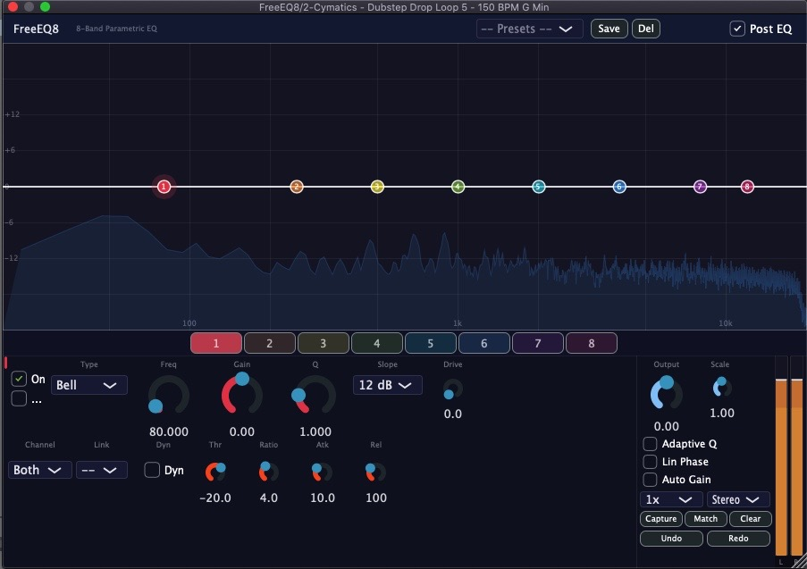
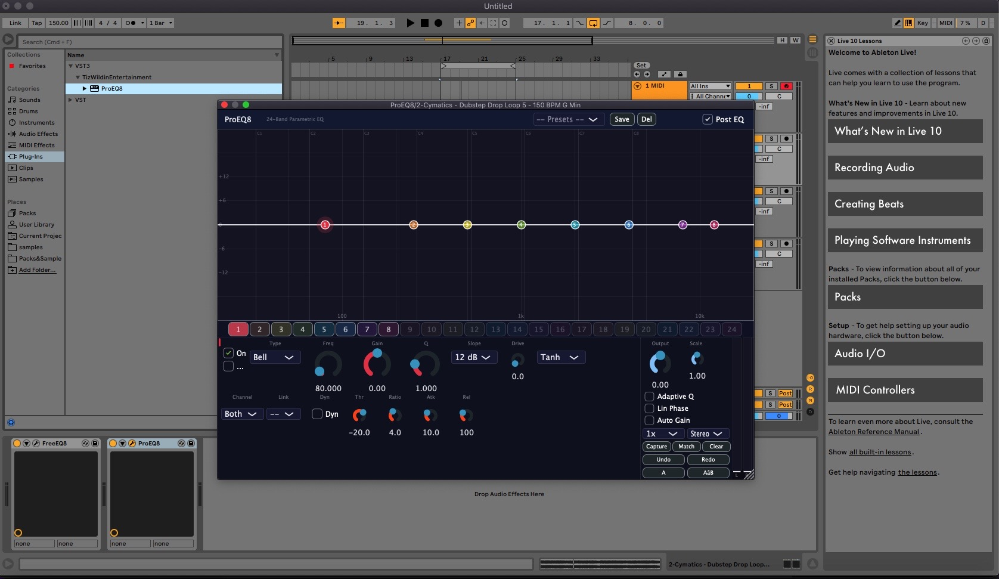
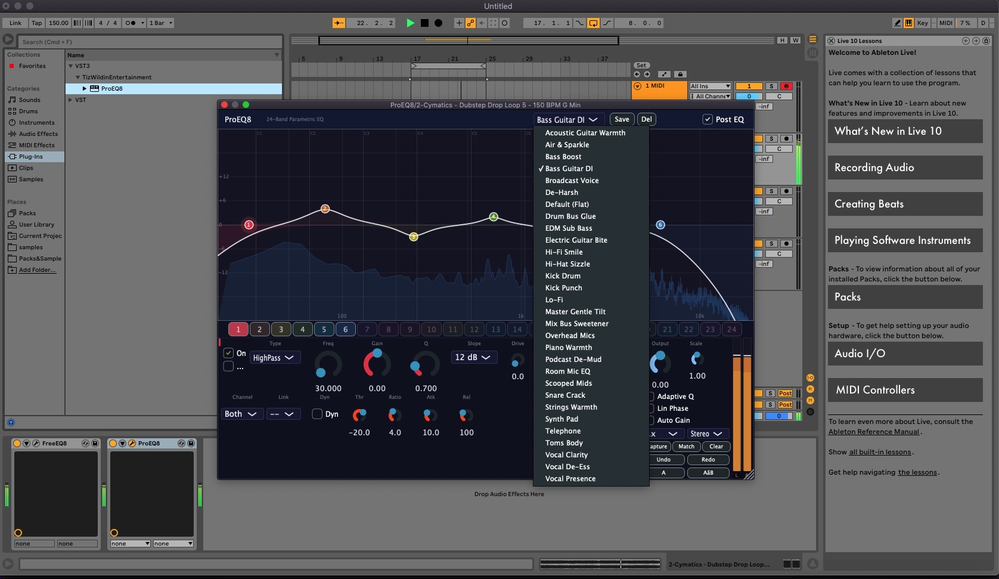

> 🎛️ Part of the [TizWildin Plugin Ecosystem](https://garebear99.github.io/TizWildinEntertainmentHUB/) — 19 free audio plugins with a live update dashboard.
>
> [FreeEQ8](https://github.com/GareBear99/FreeEQ8) · [XyloCore](https://github.com/GareBear99/XyloCore) · [Instrudio](https://github.com/GareBear99/Instrudio) · [Therum](https://github.com/GareBear99/Therum_JUCE-Plugin) · [BassMaid](https://github.com/GareBear99/BassMaid) · [SpaceMaid](https://github.com/GareBear99/SpaceMaid) · [GlueMaid](https://github.com/GareBear99/GlueMaid) · [MixMaid](https://github.com/GareBear99/MixMaid) · [MultiMaid](https://github.com/GareBear99/MultiMaid) · [MeterMaid](https://github.com/GareBear99/MeterMaid) · [ChainMaid](https://github.com/GareBear99/ChainMaid) · [PaintMask](https://github.com/GareBear99/PaintMask_Free-JUCE-Plugin) · [WURP](https://github.com/GareBear99/WURP_Toxic-Motion-Engine_JUCE) · [AETHER](https://github.com/GareBear99/AETHER_Choir-Atmosphere-Designer) · [WhisperGate](https://github.com/GareBear99/WhisperGate_Free-JUCE-Plugin) · [RiftWave](https://github.com/GareBear99/RiftWaveSuite_RiftSynth_WaveForm_Lite) · [FreeSampler](https://github.com/GareBear99/FreeSampler_v0.3) · [VF-PlexLab](https://github.com/GareBear99/VF-PlexLab) · [PAP-Forge-Audio](https://github.com/GareBear99/PAP-Forge-Audio)

> 🎧 **SoundCloud:** [TizWildin on SoundCloud](https://soundcloud.com/tizwildin) — original music, remixes, VIP mixes, experimental drops, and underground releases.
 
> 🎁 [Free Packs & Samples](#tizwildin-free-sample-packs) — jump to free packs & samples
>
> 🎵 [Awesome Audio](https://github.com/GareBear99/awesome-audio-plugins-dev) — (FREE) Awesome Audio Dev List

> ▶️ **[YouTube](https://www.youtube.com/@gfgfvmhj)** — music, visuals, demos, and releases  
> 🌊 **[Voxel Audio](https://github.com/GareBear99/Voxel_Audio)** — free RGB waveform visualizer and audio export tool  
> 📘 **[Facebook Page](https://www.facebook.com/profile.php?id=61564485196765)** — TizWildin / GareBearProductionz updates


<div align="center">
  <a href="docs/FEATURED_ON.md"><sub><b>⭐ Featured on</b> — full list →</sub></a><br>
  <a href="https://github.com/GareBear99/awesome-audio-plugins-dev#equalizers"></a>
  <a href="https://github.com/webprofusion/OpenAudio"></a>
  <a href="https://github.com/ad-si/awesome-music-production#plugins"></a>
</div>

<div align="center">
  
</div>

<div align="center">
  <a href="https://git.io/typing-svg"></a>

  <a href="https://github.com/GareBear99/FreeEQ8/actions"></a>
  <br><br>
  <a href="https://github.com/GareBear99/FreeEQ8/releases/latest"></a>
  <br><br>
  
  
  
  
  
  
  <a href="https://github.com/GareBear99/FreeEQ8"></a>
</div>

<br>


<div align="center">
  <a href="https://github.com/sponsors/GareBear99"></a>
  <a href="https://buymeacoffee.com/garebear99"></a>
  <a href="https://ko-fi.com/luciferai"></a>
</div>

FreeEQ8 is a professional-grade EQ8 / EQ Eight inspired parametric equalizer, free and open-source 8-band parametric EQ plugin for macOS, Linux, and Windows. Linear phase, dynamic EQ, match EQ, per-band drive, band linking, M/S processing, oversampling, and a real-time spectrum analyzer — all in a single, zero-cost plugin. Built with JUCE for VST3 and AU.

ProEQ8 is one of the most advanced EQs available, competing directly with top tools like ZL EQ and TDR Nova.

Works with Reaper!

<div align="center">

### ⬇️ Download Now — Free

<a href="https://github.com/GareBear99/FreeEQ8/releases/latest"></a>
<a href="https://github.com/GareBear99/FreeEQ8/releases/latest"></a>
<a href="https://github.com/GareBear99/FreeEQ8/releases/latest"></a>

FabFilter Pro-Q alternative for $0–$20

2min Demo ProEQ8 is included!

**[All releases →](https://github.com/GareBear99/FreeEQ8/releases)**

</div>

## FreeEQ8 in Ableton Live








## 🆚 How FreeEQ8 Compares

| Feature | **FreeEQ8** | FabFilter Pro-Q 4 | ZL Equalizer 2 | TDR Nova |
|---------|:-----------:|:------------------:|:--------------:|:--------:|
| **Price** | **Free** | $199 | Free | Free |
| **Open Source** | **GPL-3.0** | — | AGPL-3.0 | — |
| Bands | 8 | 24 | 24 | 4 + HP/LP |
| Dynamic EQ | **✓** (thresh / ratio / atk / rel) | ✓ | ✓ | ✓ |
| Linear Phase | **✓** | ✓ | ✓ | — |
| Match EQ | **✓** | ✓ | ✓ (WIP) | — |
| Mid/Side | **✓** (per-band) | ✓ | ✓ | — (free) |
| Per-Band Drive | **✓** (tanh saturation) | — | — | — |
| Band Linking | **✓** (groups A/B) | — | — | — |
| Oversampling | **✓** (1×–8×) | internal | — | — |
| Adaptive Q | **✓** | — | — | — |
| Spectrum Analyzer | **✓** (4096-pt FFT) | ✓ | ✓ | ✓ |
| Level Meter | **✓** (peak + RMS) | — | — | — |
| Undo / Redo | **✓** | ✓ | ✓ | — |
| Collision Detection | ✓ (Pro) | ✓ | ✓ | — |
| Surround / Atmos | — | ✓ | — | — |
| Formats | VST3, AU | VST3, AU, AAX, CLAP | VST3, AU, LV2 | VST3, AU, AAX |

> **FreeEQ8 is the only free EQ that combines linear phase + dynamic EQ + match EQ + per-band saturation + band linking in one plugin.**

## ⚡ ProEQ8 — Available Now ($20)

> **Love FreeEQ8? ProEQ8 takes everything further.**

[](https://github.com/GareBear99/FreeEQ8/releases/latest)

ProEQ8 is the commercial big brother of FreeEQ8 — same rock-solid DSP engine, massively expanded. Included in the [latest release download](https://github.com/GareBear99/FreeEQ8/releases/latest).

| | **FreeEQ8** (Free) | **ProEQ8** ($20) |
|---|:---:|:---:|
| Bands | 8 | **24** |
| Saturation Modes | tanh | **Tube · Tape · Transistor · Tanh** |
| A/B Comparison | — | **✓** (instant snapshot toggle) |
| Auto-Gain Bypass | — | **✓** (RMS-matched) |
| Piano Roll Overlay | — | **✓** (note frequency reference) |
| Collision Detection | — | **✓** (overlapping band warnings) |
| Factory Presets | 30 | **30+** (genre-specific) |
| Dynamic EQ | ✓ | ✓ |
| Linear Phase | ✓ | ✓ |
| Match EQ | ✓ | ✓ |
| Mid/Side | ✓ | ✓ |
| Oversampling | ✓ | ✓ |
| Band Linking | ✓ | ✓ |
| Formats | VST3, AU | VST3, AU |

**ProEQ8 is included in the macOS DMG download.** A license key is required to unlock it — purchase through the link above to receive your key via email. Without a license, ProEQ8 runs in demo mode: 2 minutes of clean playback, then a 30-second mute window (repeats).

## 🧠 Smart EQ Layer (v2.3 foundation)

FreeEQ8 is adding a real-time decision layer on top of the existing 8-band engine — not to replace surgical control, but to make getting to a clean mix faster than most paid EQs.

**Shipped now (v2.3 DSP foundation, no UI wiring yet):**
- `Source/DSP/ResonanceDetector.h` — log-frequency peak finder that produces up to 4 ranked suggestion bands with recommended frequency, cut-gain, Q, confidence score, and a semantic label ("mud", "boxiness", "harshness", "sibilance" …).
- `Source/DSP/IntentMode.h` — behavioural biasing: `None` / `Vocal Clean` / `Drum Punch` / `Guitar Space` / `Master Polish`. Each mode shifts the detector's scoring curve toward the frequency zones that matter for that source, without forcing preset bands.
- `Source/DSP/FrequencyExplainer.h` — static frequency → semantic description map powering the Explain-on-hover UX ("Cutting mud (320 Hz)" / "Adding air (12 kHz)").
- Deterministic, allocation-free, UI-thread safe — piggybacks on the existing triple-buffered `SpectrumFIFO`.

**Coming next (UI surfacing, tracked in [`docs/SMART_EQ_LAYER.md`](docs/SMART_EQ_LAYER.md)):**
- glowing suggestion-node overlay on the response curve
- one-click “apply suggestion” that drops a peak into the next unused band
- Explain-on-hover popup when mousing over any band
- `intent_mode` APVTS parameter + small editor dropdown
- Zero-Lag auto-switch between linear-phase (precision) and minimum-phase (real-time)

No other free open-source 8-band EQ currently combines intent-aware resonance detection + explain-on-hover + one-click apply. See [`docs/SMART_EQ_LAYER.md`](docs/SMART_EQ_LAYER.md) for the full algorithm, status matrix, and next-commit plan.

## 📊 Benchmarks & RT-safety

FreeEQ8 / ProEQ8 v2.2.0 ships with a proven real-time-safe DSP engine:
- **Zero heap allocation on the audio thread** for any user action (pooled oversamplers).
- **Canonical swap-chain triple-buffer** for both the spectrum FIFO and the linear-phase FIR kernel — verified under concurrent stress (3 runs × 400 ms, ~600 M samples, 0 tears).
- **Linear-phase FIR rebuild on a dedicated `juce::Thread`** — no FFT work on the audio thread.
- **MatchEQ chunking** handles DAW blocks of any size (previously dropped on `n > fftSize`).

Full evidence and numbers:
- [**Milestone A report**](docs/MILESTONE_A_REPORT.md) — math, benchmarks, stress-test results, sonic-impact analysis.
- [**v2.2.0 release readiness**](docs/RELEASE_v2.2.0.md) — what's verified green/yellow/red.
- [**`Tests/AuditBench.cpp`**](Tests/AuditBench.cpp) — reproducible micro-benchmarks (`clang -O3 -DNDEBUG -pthread`).
- [**`Tests/AuditRegressionTest.cpp`**](Tests/AuditRegressionTest.cpp) — concurrent-stress invariants for the triple-buffer + chunking patterns.

## ✨ Features

### Core EQ
- **8 Independent Bands** — full parametric control (frequency, Q, gain)
- **6 Filter Types** per band: Bell, Low Shelf, High Shelf, High Pass, Low Pass, Bandpass
- **Multiple Slopes** — 12 / 24 / 48 dB/oct via cascaded biquad stages
- **Per-Band Enable/Disable & Solo** for A/B comparison and audition
- **Parameter Smoothing** (20ms linear interpolation, coefficients refreshed every 16 samples)

### Advanced Processing
- **Linear Phase Mode** — symmetric FIR from combined biquad magnitude, overlap-add FFT convolution (2048-sample latency when active)
- **Dynamic EQ** — per-band envelope follower with sidechain bandpass, threshold, ratio, attack & release
- **Per-Band Saturation / Drive** — gain-compensated tanh waveshaper (0–100%)
- **Mid/Side Processing** — M/S encode/decode with per-band channel routing (Both / L-Mid / R-Side)
- **Oversampling** — 1x / 2x / 4x / 8x using JUCE polyphase IIR half-band filters
- **Band Linking** — link groups A/B propagate frequency (ratio), gain & Q (delta) changes
- **Match EQ** — capture a reference spectrum, analyze current signal, compute & apply per-bin correction via FFT
- **Adaptive Q** — automatically widens Q with increasing gain

### Visualization & UI
- **Real-Time Spectrum Analyzer** — 4096-point FFT, Hann window, pre/post EQ toggle
- **Interactive Response Curve** — composite + per-band colored curves with dB/frequency grid
- **Draggable Band Nodes** — click-drag for freq/gain, shift+drag for Q, right-click context menu
- **Stereo Level Meter** — peak hold + RMS display
- **Selected-Band Paradigm** — 8 colored band buttons, single set of controls rebound per selection
- **Dark Theme** — resizable UI (750×550 to 1400×900)

### Global Controls
- **Output Gain** (-24 dB to +24 dB)
- **Scale** (0.1x to 2x) — scales all band gains simultaneously
- **Preset System** — save / load / delete, 30 factory presets
- **Undo / Redo** — integrated with JUCE UndoManager via APVTS
- **State Save/Restore** — all settings persist in your DAW project

### DSP Specifications
- Stereo processing (or Mid/Side)
- Sample rates: 44.1 kHz to 192 kHz+
- Transposed Direct Form II biquad with double-precision (64-bit) internal arithmetic
- RBJ Audio EQ Cookbook coefficients
- Zero latency in minimum-phase mode; linear phase adds 2048 samples
- Low CPU usage (disable unused bands, lower oversampling to reduce load)

### Compatibility
- **macOS**: 10.13 High Sierra and later (universal binary: Intel + Apple Silicon)
- **Linux**: Debian/Ubuntu 20.04+ (VST3 only; see build instructions for dependencies)
- **Windows**: 10 and later (64-bit)
- **DAWs tested**: Ableton Live 10+, Logic Pro, FL Studio, Bitwig, REAPER
- **Formats**: VST3, AU (macOS), Standalone (all platforms)

## 🚀 Quick Start

### macOS
```bash
git clone --recursive https://github.com/GareBear99/FreeEQ8.git
cd FreeEQ8
./build_macos.sh
```

### Linux (Debian/Ubuntu)
```bash
git clone --recursive https://github.com/GareBear99/FreeEQ8.git
cd FreeEQ8
./build_linux.sh          # installs deps via apt, then builds
```

### Windows
```powershell
git clone --recursive https://github.com/GareBear99/FreeEQ8.git
cd FreeEQ8
.\build_windows.ps1
```

Plugins will be automatically installed to your system plugin directories.

## 📋 Build Instructions

### Prerequisites

#### macOS
- Xcode Command Line Tools: `xcode-select --install`
- CMake 3.15+: `brew install cmake`

#### Linux (Debian/Ubuntu)
- GCC 9+ or Clang 10+
- CMake 3.15+
- JUCE system dependencies (installed automatically by `build_linux.sh`):
  `libasound2-dev libjack-jackd2-dev libfreetype6-dev libx11-dev libxcomposite-dev libxcursor-dev libxext-dev libxfixes-dev libxinerama-dev libxrandr-dev libxrender-dev libwebkit2gtk-4.0-dev`

#### Windows
- Visual Studio 2019+ with C++ build tools
- CMake 3.15+

### Detailed Build Steps

#### 1. Clone with JUCE Submodule

```bash
git clone --recursive https://github.com/GareBear99/FreeEQ8.git
cd FreeEQ8
```

If you already cloned without `--recursive`:
```bash
git submodule update --init --recursive
cd JUCE && git checkout 7.0.12 && cd ..
```

#### 2. Build

**macOS:**
```bash
chmod +x build_macos.sh
./build_macos.sh
```

**Linux:**
```bash
chmod +x build_linux.sh
./build_linux.sh
```

**Windows:**
```powershell
.\build_windows.ps1
```

#### 3. Plugin Installation

**macOS (automatic):**
- VST3: `~/Library/Audio/Plug-Ins/VST3/FreeEQ8.vst3`
- AU: `~/Library/Audio/Plug-Ins/Components/FreeEQ8.component`

**Linux (manual):**
- Copy `build/FreeEQ8_artefacts/Release/VST3/FreeEQ8.vst3` to `~/.vst3/`

**Windows (manual):**
- Copy `build\FreeEQ8_artefacts\Release\VST3\FreeEQ8.vst3` to:
  - `C:\Program Files\Common Files\VST3\`

#### 4. Rescan in Your DAW
- **Ableton Live**: Preferences → Plug-ins → Rescan
- **Logic Pro**: Automatic detection
- **FL Studio**: Options → Manage plugins → Find plugins

## 🎛️ Usage Guide

### Parameter Ranges
| Parameter | Range | Scale | Description |
|-----------|-------|-------|-------------|
| Frequency | 20 Hz – 20 kHz | Logarithmic | Center/cutoff frequency |
| Q | 0.1 – 24 | Logarithmic | Bandwidth (0.1 = wide, 24 = narrow) |
| Gain | -24 dB to +24 dB | Linear | Boost/cut amount |
| Slope | 12 / 24 / 48 dB/oct | Discrete | Filter steepness (1/2/4 cascaded stages) |
| Drive | 0 – 100 % | Linear | Per-band tanh saturation amount |
| Channel | Both / L-Mid / R-Side | Discrete | Per-band channel routing |
| Link Group | -- / A / B | Discrete | Band linking group |
| Dyn Threshold | -60 dB to 0 dB | Linear | Dynamic EQ threshold |
| Dyn Ratio | 1:1 – 20:1 | Logarithmic | Dynamic EQ compression ratio |
| Dyn Attack | 0.1 – 100 ms | Logarithmic | Dynamic EQ attack time |
| Dyn Release | 1 – 1000 ms | Logarithmic | Dynamic EQ release time |
| Output | -24 dB to +24 dB | Linear | Master output level |
| Scale | 0.1x – 2x | Linear | Global gain multiplier |

### Common EQ Techniques

#### Surgical EQ (Problem Frequency Removal)
```
Band: Bell filter
Q: 6-12 (narrow)
Gain: -6 to -12 dB
```

#### Musical EQ (Broad Tonal Shaping)
```
Band: Bell/Shelf filter
Q: 0.5-2 (wide)
Gain: ±3 to ±6 dB
```

#### High-Pass Filtering
```
Band: HighPass filter
Freq: 20-120 Hz (depends on source)
Q: 0.7 (standard)
```

### Example Settings

**Kick Drum:**
- Band 1: Bell @ 60Hz, Q=1.5, +4dB (sub thump)
- Band 2: Bell @ 200Hz, Q=3, -3dB (cardboard removal)
- Band 3: Bell @ 3kHz, Q=2, +2dB (beater click)

**Acoustic Guitar:**
- Band 1: HighPass @ 80Hz (rumble removal)
- Band 2: Bell @ 200Hz, Q=1.5, -2dB (boominess)
- Band 3: Bell @ 3kHz, Q=1, +3dB (presence)
- Band 4: HighShelf @ 8kHz, +2dB (air)

**Vocals:**
- Band 1: HighPass @ 80Hz (rumble)
- Band 2: Bell @ 250Hz, Q=2, -3dB (muddiness)
- Band 3: Bell @ 1kHz, Q=1, +2dB (body)
- Band 4: Bell @ 5kHz, Q=2, +3dB (clarity)

## 🔧 Technical Details

### Architecture
```
┌──────────────────────────────────────────────────────┐
│               FreeEQ8 Audio Processor                │
├──────────────────────────────────────────────────────┤
│  Input Buffer (Stereo)                               │
│          ↓                                           │
│  Spectrum FIFO (pre-EQ) ──→ UI spectrum display      │
│          ↓                                           │
│  ┌─── IF linear_phase ───┐  ┌── ELSE (min-phase) ──┐│
│  │ Build composite mag   │  │ Oversampling ↑ (opt.) ││
│  │ response from biquads │  │       ↓               ││
│  │       ↓               │  │ M/S Encode (optional) ││
│  │ FIR convolution       │  │       ↓               ││
│  │ (overlap-add FFT,     │  │ Per-band loop ×8:     ││
│  │  4096-tap, 8192 FFT,  │  │  ├ Dyn EQ envelope    ││
│  │  2048-sample latency) │  │  ├ Smooth + update    ││
│  │       ↓               │  │  │  coefficients      ││
│  │ Output Gain           │  │  ├ Cascaded biquads   ││
│  └───────────────────────┘  │  │  (1/2/4 stages)    ││
│                              │  └ Drive (tanh)       ││
│                              │       ↓               ││
│                              │ Output Gain & Scale   ││
│                              │       ↓               ││
│                              │ M/S Decode (optional) ││
│                              │       ↓               ││
│                              │ Oversampling ↓ (opt.) ││
│                              └───────────────────────┘│
│          ↓                                           │
│  Match EQ correction (FFT overlap-add, optional)     │
│          ↓                                           │
│  Spectrum FIFO (post-EQ) ──→ UI spectrum display     │
│          ↓                                           │
│  Output Metering (peak hold + RMS)                   │
│          ↓                                           │
│  Output Buffer (Stereo)                              │
└──────────────────────────────────────────────────────┘
```

### DSP Implementation
- **Filter Structure**: Transposed Direct Form II biquad (Biquad.h)
- **Coefficient Calculation**: RBJ Audio EQ Cookbook
- **Smoothing**: Linear interpolation over 20ms
- **Update Rate**: Coefficients refreshed every 16 samples during smoothing
- **Precision**: Double-precision (64-bit) coefficients and internal state; float I/O
- **Linear Phase**: 4096-tap symmetric FIR, 8192-point FFT, overlap-add convolution
- **Dynamic EQ**: One-pole envelope follower with sidechain bandpass at band frequency
- **Spectrum**: 4096-point FFT, Hann window, lock-free SPSC FIFO

### Project Structure
```
FreeEQ8/
├── Source/
│   ├── PluginProcessor.h/.cpp     # Main audio processor
│   ├── PluginEditor.h/.cpp        # UI editor & layout
│   ├── DSP/
│   │   ├── Biquad.h               # Biquad filter implementation
│   │   ├── EQBand.h               # EQ band with smoothing, drive & dynamic EQ
│   │   ├── SpectrumFIFO.h         # Lock-free FFT FIFO
│   │   ├── LinearPhaseEngine.h    # FIR-based linear-phase EQ engine
│   │   └── MatchEQ.h              # Reference capture & correction curve
│   ├── UI/
│   │   ├── ResponseCurveComponent.h/.cpp  # EQ curve + spectrum + nodes
│   │   └── LevelMeter.h           # Stereo peak/RMS level meter
│   ├── Presets/
│   │   └── PresetManager.h/.cpp   # Preset save/load system
│   ├── UpdateChecker.h            # GitHub releases update checker
│   └── LicenseValidator.h         # Offline license key validation
├── server/
│   ├── stripe-webhook.js          # Cloudflare Worker for Stripe → license
│   ├── wrangler.toml              # Wrangler deployment config
│   └── package.json               # Server dependencies (wrangler)
├── STRIPE_SETUP.md                # ProEQ8 Stripe deployment guide
├── docs/                          # Screenshots & assets
├── JUCE/                          # JUCE framework (submodule)
├── build/                         # Build output (ignored)
├── CMakeLists.txt                 # CMake config (FreeEQ8 + ProEQ8 targets)
├── build_macos.sh                 # macOS build script
├── build_linux.sh                 # Linux build script
├── build_windows.ps1              # Windows build script
├── package_macos.sh               # macOS DMG packaging script
├── .gitignore                     # Git ignore rules
└── README.md                      # This file
```

## 🛣️ Roadmap

### v0.4.0
- [x] Real-time spectrum analyzer
- [x] Interactive frequency response curve display
- [x] Draggable band nodes on curve
- [x] Adaptive Q implementation
- [x] Band solo/audition mode
- [x] Preset management system

### v0.5.0
- [x] Multiple filter slopes (12/24/48 dB/oct) via cascaded biquads
- [x] Mid/Side processing mode with M/S encode/decode
- [x] Per-band channel routing (Both / L-Mid / R-Side)
- [x] Oversampling options (1x, 2x, 4x, 8x)
- [x] Output metering with peak hold and RMS
- [x] Resizable UI (700×500 to 1400×900)

### v1.0.0
- [x] Linear phase mode (FIR convolution via overlap-add FFT)
- [x] Dynamic EQ capabilities (per-band envelope follower with threshold/ratio/attack/release)
- [x] Band linking (link groups A/B with delta-based freq/gain/Q propagation)
- [x] Per-band saturation/drive (gain-compensated tanh waveshaper)
- [x] Undo/Redo system (integrated with APVTS UndoManager)
- [x] Match EQ functionality (capture reference spectrum, compute & apply correction)

### v2.0.0
- [x] Online license activation (2 devices per key) with Stripe checkout
- [x] ProEQ8 commercial target (24 bands, 4 saturation modes, A/B, auto-gain)
- [x] Cloudflare Worker license server + Resend email delivery
- [x] Demo mode for unactivated ProEQ8 (mutes 30s every 5min)

### v2.1.0
- [x] Standalone app included in all platform packages
- [x] Hardened ProEQ8 license: device-bound activation, 7-day re-verify, 30-day offline grace
- [x] Server /verify endpoint for periodic re-validation
- [x] Obfuscated signing secret in binary
- [x] Fixed JUCE 7.0.12 API compatibility

### v2.2.0 (Current Release)
- [x] Real-time safety: zero heap allocation on the audio thread for any user action (Milestone A / A1)
- [x] `SpectrumFIFO` + `LinearPhaseEngine` kernel on canonical swap-chain triple-buffer (A4 / A5)
- [x] Linear-phase FIR rebuild moved to a dedicated `juce::Thread` worker (A5)
- [x] `MatchEQ::applyCorrection` handles arbitrarily large DAW blocks instead of silent early-return (A3)
- [x] Editor modal dialogs + license HTTP callbacks are lifetime-safe via `juce::WeakReference` (A2)
- [x] Demo cadence: 2 minutes of clean playback + 30-second mute window
- [x] `getTailLengthSeconds` reports the MatchEQ overlap-add tail for offline renders (A7)

### v2.3.0 (In Progress) — Smart EQ Layer
- [x] Resonance detector (log-frequency, intent-weighted peak finder)
- [x] Intent Mode weighting curves (None / Vocal Clean / Drum Punch / Guitar Space / Master Polish)
- [x] Frequency Explainer semantic map
- [ ] `intent_mode` APVTS parameter + editor dropdown
- [ ] Response-curve overlay with glowing suggestion nodes
- [ ] Explain-on-hover popup on band nodes
- [ ] One-click “apply suggestion” into next unused band
- [ ] Zero-Lag auto-switch between linear-phase and minimum-phase modes

## 🤝 Contributing

Contributions are welcome! Here's how you can help:

1. **Fork the repository**
2. **Create a feature branch**: `git checkout -b feature/amazing-feature`
3. **Commit your changes**: `git commit -m 'Add amazing feature'`
4. **Push to the branch**: `git push origin feature/amazing-feature`
5. **Open a Pull Request**

### Development Guidelines
- Follow existing code style
- Add comments for complex DSP algorithms
- Test on both macOS and Windows if possible
- Update documentation for new features

### Areas for Contribution
- 🎨 UI/UX improvements
- 🔊 Additional filter types
- 🐛 Bug fixes and optimizations
- 📚 Documentation improvements
- 🧪 Unit tests

## 📝 Changelog

### v2.3.0-dev (2026-04-23)
- ✅ Smart EQ Layer DSP foundation: `ResonanceDetector`, `IntentMode`, `FrequencyExplainer` shipped as standalone headers with zero wiring into `processBlock` (no risk to existing users).
- ✅ Design + roadmap documented in `docs/SMART_EQ_LAYER.md`; status matrix tracks what's shipped vs. pending UI surfacing.
- Next cut will wire the `intent_mode` parameter, detector instance, and UI overlay.

### v2.2.0 (2026-04-23)
- ✅ Milestone A real-time safety + correctness pass: oversampler pool, triple-buffered SPSC for spectrum FIFO + linear-phase kernel, off-audio-thread FIR rebuild, MatchEQ chunking for oversized blocks, editor lifetime safety
- ✅ Demo cadence: 2 min clean + 30 s mute (was 4:30 / 30 s)
- ✅ `getTailLengthSeconds` covers MatchEQ tail (offline render correctness)
- ✅ See `docs/MILESTONE_A_REPORT.md` for proofs, benchmarks, and stress-test evidence

### v2.1.0 (2026-03-25)
- ✅ Standalone app now included in macOS DMG, Windows ZIP, Linux tar.gz
- ✅ Hardened ProEQ8 license system: device-bound activation (2 systems per key)
- ✅ Periodic server re-verification every 7 days (30-day offline grace period)
- ✅ XOR-obfuscated signing secret in binary
- ✅ Server `/verify` endpoint for client re-validation
- ✅ Background license re-verify on ProEQ8 editor open when overdue
- ✅ Fixed `inPostBody` → `inPostData` for JUCE 7.0.12 API
- ✅ Added `workflow_dispatch` trigger for manual CI runs

### v2.0.0 (2026-03-25)
- ✅ Online license activation for ProEQ8 (2-device limit per key)
- ✅ Stripe Checkout → Cloudflare Worker webhook → HMAC-signed license key → email via Resend
- ✅ Device fingerprinting (hardware UUID on macOS, MachineGuid on Windows, machine-id on Linux)
- ✅ Demo mode for unactivated ProEQ8 (mutes 30s every 5min)
- ✅ Deactivation support to free device slots

### v1.1.0 (ProEQ8 + Enhancements)
- ✅ ProEQ8 commercial target: 24-band parametric EQ (same source, PROEQ8=1 compile flag)
- ✅ 4 saturation modes per band (Pro): Tanh, Tube, Tape, Transistor
- ✅ A/B comparison (Pro): instant snapshot toggle with Copy A→B / B→A
- ✅ Auto-gain bypass: RMS-matched loudness compensation for honest A/B listening
- ✅ Piano roll overlay (Pro): musical note reference lines C1–C8 on the response curve
- ✅ Collision detection (Pro): amber warning when bands overlap within 1/3 octave
- ✅ Update checker: background thread checks GitHub releases, shows banner when new version available
- ✅ License validator + activation dialog (Pro): offline license keys, demo mode (mute 30s every 5min)
- ✅ Stripe webhook serverless function: Cloudflare Worker generates license keys, emails via Resend
- ✅ 30 genre-specific factory presets
- ✅ Fixed preset directory using product name (not hardcoded)
- ✅ Fixed factory preset OOB access for ProEQ8's 24-band layout

### v1.0.0 (2026-02-25)
- ✅ Linear phase mode: symmetric FIR from combined biquad magnitude, overlap-add FFT convolution (2048-sample latency)
- ✅ Dynamic EQ: per-band envelope follower with sidechain bandpass, threshold, ratio, attack & release
- ✅ Band linking: link groups A/B propagate freq (ratio-based), gain & Q (delta-based) changes
- ✅ Per-band saturation/drive: gain-compensated tanh waveshaper (0–100%)
- ✅ Undo/Redo system via juce::UndoManager integrated with APVTS
- ✅ Match EQ: capture reference spectrum, compute per-bin correction, FFT-based application
- ✅ New parameters: drive, dynamic EQ (threshold/ratio/attack/release), link group per band
- ✅ Updated UI: undo/redo buttons, dynamic EQ toggle + threshold, link group selector, drive knob

### v0.5.0 (2026-02-25)
- ✅ Multiple filter slopes: 12/24/48 dB/oct per band via cascaded biquad stages
- ✅ Mid/Side processing mode with stereo encode/decode
- ✅ Per-band channel routing: Both / Left(Mid) / Right(Side)
- ✅ Oversampling: 1x / 2x / 4x / 8x using JUCE polyphase IIR
- ✅ Output level metering with peak hold and RMS display
- ✅ Resizable UI with proportional layout (750×550 to 1400×900)
- ✅ New global controls: Oversampling selector, Processing Mode selector
- ✅ Per-band controls: Slope selector, Channel routing selector

### v0.4.0 (2026-02-25)
- ✅ Real-time spectrum analyzer (4096-point FFT, pre/post EQ toggle)
- ✅ Interactive frequency response curve display with grid
- ✅ Draggable band nodes (click-drag for freq/gain, shift+drag for Q)
- ✅ Per-band colored curves with composite response overlay
- ✅ Adaptive Q DSP implementation (auto-scales Q with gain)
- ✅ Band solo/audition mode ("S" button per band)
- ✅ Preset management (save/load/delete, 8 factory presets)
- ✅ Complete UI overhaul (900×620, dark theme, response curve on top)
- ✅ Right-click context menu on band nodes (type change, enable/disable)
- ✅ Attribution updated to Gary Doman (GareBear99)

### v0.3.0 (2026-01-28)
- ✅ Added output gain control (-24dB to +24dB)
- ✅ Added global scale parameter (0.1x to 2x)
- ✅ Added adaptive Q toggle (UI only, DSP pending)
- ✅ Enhanced UI layout with global controls
- ✅ Fixed JUCE 7.0.12 compatibility issues
- ✅ Fixed VST3 build on macOS with Xcode 12
- ✅ Improved parameter smoothing
- ✅ Updated build scripts for reliability

### v0.2.0
- 8-band parametric EQ
- RBJ biquad filters (Bell, Shelf, HP, LP)
- Parameter smoothing (20ms)
- State save/restore via APVTS
- CMake build system for VST3/AU

### v0.1.0
- Initial prototype

## 📄 License

This project is licensed under the GNU General Public License v3.0 - see the [LICENSE](LICENSE) file for details.

**Note:** JUCE has its own licensing requirements. For commercial use, you may need a JUCE license. See [JUCE Licensing](https://juce.com/discover/licensing) for details.

## ⚠️ Legal Notice

FreeEQ8 is an **original implementation** of a parametric EQ plugin. It is:
- **NOT** affiliated with, endorsed by, or derived from Ableton AG
- **NOT** a clone of Ableton's EQ Eight
- An independent, open-source project
- Built using public-domain DSP algorithms (RBJ Audio EQ Cookbook)

## 🐛 Known Issues

- Changing oversampling mid-playback may cause a brief click
- Linear phase mode adds 2048 samples of latency (reported to DAW via `setLatencySamples`)
- Match EQ capture is mono-summed; correction is per-channel
- Linear phase mode does not currently apply M/S, per-band drive, or dynamic EQ (minimum-phase path only)

Report issues at: https://github.com/GareBear99/FreeEQ8/issues

## 💡 Tips & Tricks

### Performance Optimization
- Disable unused bands to reduce CPU load
- Use wider Q values (lower numbers) for smoother processing
- Enable adaptive Q for automatic gain-dependent Q adjustment

### Mixing Workflow
1. Start with subtractive EQ (cut problem frequencies)
2. Use narrow Q to identify resonances
3. Use wide Q for musical boosts
4. Check your EQ in mono to avoid phase issues

### Sound Design
- Stack multiple bell filters at the same frequency with different Q values
- Automate the scale parameter for dramatic filter sweeps
- Use extreme Q values (>10) for creative resonances

## 🙏 Acknowledgments

- **JUCE Framework** - Cross-platform audio plugin framework
- **Robert Bristow-Johnson** - RBJ Audio EQ Cookbook
- **Audio Plugin Development Community** - For knowledge sharing
- **Ableton** - For inspiration (not affiliation)

## 💖 Support the Project

FreeEQ8 is free and open source. If it's useful to you, consider supporting development:

<a href="https://github.com/sponsors/GareBear99"></a>
<a href="https://buymeacoffee.com/garebear99"></a>
<a href="https://ko-fi.com/luciferai"></a>

Other ways to help:
- ⭐ **Star this repo** — helps others find FreeEQ8
- 🐛 **Report bugs** — [open an issue](https://github.com/GareBear99/FreeEQ8/issues)
- 🔀 **Contribute** — PRs are welcome
- 📣 **Spread the word** — tell a producer friend

## 📧 Contact

- **Issues**: [GitHub Issues](https://github.com/GareBear99/FreeEQ8/issues)
- **Discussions**: [GitHub Discussions](https://github.com/GareBear99/FreeEQ8/discussions)
- **Email**: neovectr.inc@gmail.com

---

**Other Projects by Me!**

https://github.com/GareBear99/TizWildinEntertainmentHUB

https://github.com/GareBear99/awesome-audio-plugins-dev

https://github.com/GareBear99/PaintMask_Free-JUCE-Plugin

https://github.com/GareBear99/WURP_Toxic-Motion-Engine_JUCE

https://github.com/GareBear99/RiftWaveSuite_RiftSynth_WaveForm_Lite

https://github.com/GareBear99/AETHER_Choir-Atmosphere-Designer

https://github.com/GareBear99/WhisperGate_Free-JUCE-Plugin

https://github.com/GareBear99/Therum_JUCE-Plugin

https://github.com/GareBear99/MixMaid

https://github.com/GareBear99/BassMaid

https://github.com/GareBear99/SpaceMaid

https://github.com/GareBear99/GlueMaid

https://github.com/GareBear99/XyloCore

**Built with ❤️ by Gary Doman (GareBear99/TizWildin)**

*"Great sound shouldn't cost anything"*
<p align="center">
  
</p>

## TizWildin FREE sample packs

| Pack | Description |
|------|-------------|
| [**TizWildin-Aurora**](https://github.com/GareBear99/TizWildin-Aurora) | 3-segment original synth melody pack with loops, stems, demo renders, and neon/cinematic phrasing |
| [**TizWildin-Obsidian**](https://github.com/GareBear99/TizWildin-Obsidian) | Dark cinematic sample pack with choir textures, menu loops, transitions, bass, atmosphere, drums, and electric-banjo extensions |
| [**TizWildin-Skyline**](https://github.com/GareBear99/TizWildin-Skyline) | 30 BPM-tagged synthwave and darkwave loops with generator snapshot and dark neon additions |
| [**TizWildin-Chroma**](https://github.com/GareBear99/TizWildin-Chroma) | Multi-segment game synthwave loop sample pack from TizWildin Entertainment |
| [**TizWildin-Chime**](https://github.com/GareBear99/TizWildin-Chime) | Multi-part 88 BPM chime collection spanning glass, void, halo, reed, and neon synthwave lanes |
| [**Free Violin Synth Sample Kit**](https://github.com/GareBear99/Free-Violin-Synth-Sample-Kit) | Physical-model violin sample kit rendered from the Instrudio violin instrument |
| [**Free Dark Piano Sound Kit**](https://github.com/GareBear99/Free-Dark-Piano-Sound-Kit) | 88 piano notes + dark/cinematic loops and MIDI |
| [**Free 808 Producer Kit**](https://github.com/GareBear99/Free-808-Producer-Kit) | 94 hand-crafted 808 bass samples tuned to every chromatic key |
| [**Free Riser Producer Kit**](https://github.com/GareBear99/Free-Riser-Producer-Kit) | 115+ risers and 63 downlifters - noise, synth, drum, FX, cinematic |
| [**Phonk Producer Toolkit**](https://github.com/GareBear99/Phonk_Producer_Toolkit) | Drift phonk starter kit - 808s, cowbells, drums, MIDI, templates |
| [**Free Future Bass Producer Kit**](https://github.com/GareBear99/Free-Future-Bass-Producer-Kit) | Loops, fills, drums, bass, synths, pads, and FX |

### Related audio projects
- [**VF-PlexLab**](https://github.com/GareBear99/VF-PlexLab) - VocalForge PersonaPlex Lab starter repo for a JUCE plugin + local backend + HTML tester around NVIDIA PersonaPlex.
- [**PAP-Forge-Audio**](https://github.com/GareBear99/PAP-Forge-Audio) - Procedural Autonomous Plugins runtime for generating, branching, validating, and restoring plugin projects from natural-language sound intent.
